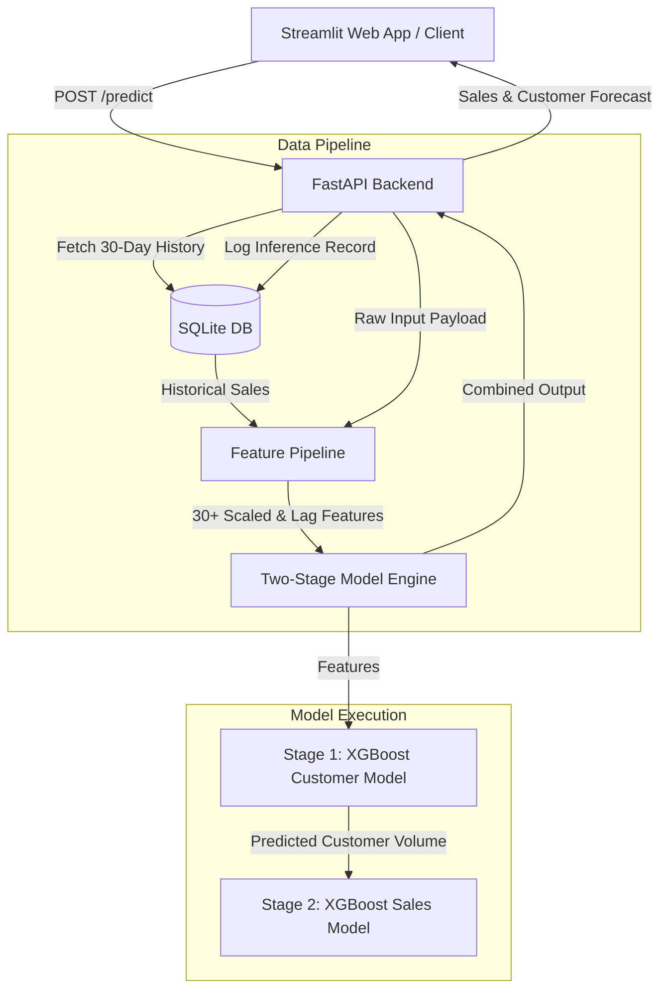

# 🏪 Rossmann Store Sales & Demand Forecasting

[](https://www.python.org/)
[](https://fastapi.tiangolo.com/)
[](https://streamlit.io/)
[](https://xgboost.readthedocs.io/)
[](https://www.sqlite.org/)

An end-to-end enterprise Machine Learning system for predicting daily sales and customer traffic across 1,100+ Rossmann store locations. Built with a sequential **Two-Stage XGBoost Model Architecture**, dynamic **Feature Engineering Pipeline**, a high-performance **FastAPI** backend, and an interactive **Streamlit** dashboard.

---

## 📌 Table of Contents

- [Overview](#-overview)
- [Key Features](#-key-features)
- [System Architecture](#-system-architecture)
- [Project Structure](#-project-structure)
- [Tech Stack](#-tech-stack)
- [Installation \& Setup](#-installation--setup)
- [Usage Guide](#-usage-guide)
  - [1. Launch FastAPI Backend](#1-launch-fastapi-backend)
  - [2. Launch Streamlit Web UI](#2-launch-streamlit-web-ui)
- [API Reference](#-api-reference)
- [Feature Engineering Pipeline](#-feature-engineering-pipeline)
- [Notebook Workflows](#-notebook-workflows)

---

## 💡 Overview

Forecasting daily store sales accurately enables retail chains to optimize inventory, staffing schedules, and promotional strategies. The **Rossmann Store Sales Forecasting System** solves the challenge of non-linear demand seasonality, promotional impact, and variable customer volume by leveraging a two-stage sequential inference strategy:

1. **Stage 1 (Customer Estimation):** Predicts expected customer footfall using store metadata, promotional state, calendar indicators, and time-series history.
2. **Stage 2 (Sales Forecasting):** Predicts total store revenue by combining the estimated customer count from Stage 1 with dynamic rolling statistics and lag metrics.

---

## ✨ Key Features

- **Sequential Two-Stage Machine Learning Pipeline:** Integrates intermediate customer volume predictions into the final sales model to capture strong customer-to-sales correlations.
- **Dynamic Feature Pipeline:** Computes lag features (7th, 14th, 21st, 28th lags), rolling statistics (3-day, 7-day, 15-day, 30-day moving averages & standard deviations), promotional streaks, and holiday proximity metrics on the fly.
- **SQLite Database Persistence:** Stores recent sales history to calculate continuous rolling metrics and records all historical inference payloads.
- **RESTful FastAPI Service:** Containerized REST endpoints for single-row dynamic model inference and live ground-truth data insertion.
- **Interactive Streamlit Web App:** Simple user interface for store managers to forecast demand or insert actual daily metrics without writing code.

---

## 🏗 System Architecture



---

## 📂 Project Structure

```
Store sales/
├── Data/                   # Raw and processed datasets
├── Data_Schema/            # Feature engineering & database schema pipelines
│   ├── create_lag_rolling_features.py  # Lag & moving average feature creation
│   ├── data_pipeline.py                # Main FeaturePipeline transformer
│   ├── fetch_data.py                   # Database query routines for history
│   ├── inference_to_main.py            # ground truth data sync logic
│   ├── input_data.py                   # Pydantic schema validation classes
│   └── storing_data.py                 # SQLite database storage handlers
├── DB/                     # SQLite database storage directory
│   └── Sales_data.db       # Historical sales & inference dataset DB
├── Notebooks/              # Jupyter notebooks for data analysis & training
│   ├── data_cleaning.ipynb
│   ├── data_exploration_&_feature_engineering.ipynb
│   └── model_building_new.ipynb
├── utilities/              # Pretrained models & categorical metadata
│   ├── categorical_schemas.pkl
│   ├── customer_final_model.pkl
│   └── sales_final_model.pkl
├── app.py                  # FastAPI server definition & API routing
├── main.py                 # Streamlit web dashboard client
├── predictor.py            # TwoStageModelPipeline inference runner
├── requirements.txt        # Python package dependencies
└── README.md               # Project documentation
```

---

## 🛠 Tech Stack

- **Machine Learning & Core:** Python 3.9+, XGBoost, LightGBM, Pandas, NumPy, Scikit-learn
- **API Framework:** FastAPI, Pydantic, Uvicorn, Requests
- **Frontend / Dashboard:** Streamlit
- **Database:** SQLite
- **Visualization & EDA:** Seaborn, Matplotlib

---

## 🚀 Installation & Setup

### 1. Clone the Repository & Navigate to Folder

```bash
git clone https://github.com/Ashwin-619/Rossmann-Store-Sales-Forecasting.git
cd Rossmann-Store-Sales-Forecasting
```

### 2. Create and Activate a Virtual Environment

```bash
# Windows
python -m venv venv
.\venv\Scripts\activate

# Linux/macOS
python3 -m venv venv
source venv/bin/activate
```

### 3. Install Required Dependencies

```bash
pip install -r requirements.txt
```

---

## 💻 Usage Guide

### 1. Launch FastAPI Backend

Start the FastAPI application on host `http://127.0.0.1:8000`:

```bash
uvicorn app:app --reload
```

*Interactive API Documentation (Swagger UI) will be accessible at: `http://127.0.0.1:8000/docs`*

### 2. Launch Streamlit Web UI

In a separate terminal window (with virtual environment activated):

```bash
streamlit run main.py
```

*The Streamlit web dashboard will automatically open in your default browser at `http://localhost:8501`.*

---

## 📡 API Reference

### `GET /`
**Description:** Health check endpoint to ensure API service status.

- **Response:** `200 OK`
```json
{
  "message": "Two-stage sales prediction service online."
}
```

---

### `POST /predict`
**Description:** Generates customer and sales predictions for a specific store on a target date.

- **Request Body:**
```json
{
  "Store": 1,
  "DayOfWeek": "1",
  "Is_Promo_Active": 1,
  "School_holiday": 0,
  "Storetype": "a",
  "Assortment": "Basic",
  "Competition_Distance": 1270,
  "Is_Promo2_Active": 0,
  "Date": "2015-08-01",
  "Next_holiday": "2015-08-15"
}
```

- **Response:** `200 OK`
```json
{
  "predictions_for_Sales": 5420,
  "predictions_for_Customers": 585,
  "input": { ... }
}
```

---

### `POST /Insert_Data`
**Description:** Inserts actual ground truth sales and customer figures for continuous rolling metric updates.

- **Request Body:**
```json
{
  "Store": 1,
  "Date": "2015-08-01",
  "Sales": 5263,
  "Customers": 555
}
```

- **Response:** `200 OK`
```json
{
  "message": "Data inserted successfully."
}
```

---

## 📊 Feature Engineering Pipeline

The transformation engine automatically extracts dynamic time-series features from raw inputs:

| Feature Category | Features Derived |
| :--- | :--- |
| **Lag Features** | `7th_lag`, `14th_lag`, `21st_lag`, `28th_lag`, `7_8_lag_dif` |
| **Moving Averages** | `ma_3d_lag7`, `ma_7d_lag7`, `ma_15d_lag7`, `ma_30d_lag7`, `std_3d_lag7` |
| **Promotions** | `consecutive_promo_days`, `consecutive_promo2_days` |
| **Holidays** | `days_till_next_holiday`, `days_after_holiday` |
| **Categoricals** | `StoreType`, `Assortment`, Interaction features (`promo_x_dayofweek`, `promo2_x_storetype`) |

---

## 📓 Notebook Workflows

The exploratory data analysis, data wrangling, feature engineering, and model training pipelines are fully documented across three interactive Jupyter notebooks located in the [`Notebooks/`](file:///c:/Users/ashwi/OneDrive/Desktop/Projects/Store%20sales/Notebooks) directory:

---

### 1. [`data_cleaning.ipynb`](file:///c:/Users/ashwi/OneDrive/Desktop/Projects/Store%20sales/Notebooks/data_cleaning.ipynb) — Data Preprocessing & Metadata Integration
- **Raw Data Merging & Indexing:** Joined transactional store sales (`train.csv`) with store metadata (`store.csv`) on `Store` ID. Converted `Date` to a datetime index sorted chronologically, extracting fundamental date components (`year`, `month`, `day`).
- **Missing Value Imputation:**
  - Imputed missing `CompetitionDistance` using column **mean** (~2,640 meters).
  - Filled missing values in `CompetitionOpenSinceMonth` and `CompetitionOpenSinceYear` using column **medians**.
  - Filled missing values in `Promo2SinceWeek` and `Promo2SinceYear` using column **medians**.
  - Imputed missing string values in `PromoInterval` with `'NoPromoInterval'`.
- **Categorical & Schema Standardizations:**
  - Cleaned `StateHoliday` column (mapping numeric `0` to string `'0'`) before dropping it due to extreme sparsity and low variance.
  - Standardized categorical labels for store `Assortment` (`'a'` $\rightarrow$ `'Basic'`, `'b'` $\rightarrow$ `'Extra'`, `'c'` $\rightarrow$ `'Extended'`).
  - Explicitly cast competition open metrics and Promo2 start features to integer data types (`int`).
- **Outlier Diagnostics & Closure Analysis:**
  - Inspected store closure distributions (`Open == 0`, accounting for ~17.15% of records).
  - Evaluated extreme outlier sales days (> 75th percentile) and verified distribution stability across historical operating years (2013–2015).
- **Data Export:** Exported sanitized data structures into optimized Parquet files (`cleaned_data.parquet` and `cleaned_store_data.parquet`).

---

### 2. [`data_exploration_&_feature_engineering.ipynb`](file:///c:/Users/ashwi/OneDrive/Desktop/Projects/Store%20sales/Notebooks/data_exploration_%26_feature_engineering%20.ipynb) — Feature Pipeline & Target Transformation
- **Target Log Transformation:** Identified strong right-skewness in target distribution (`Sales` & `Customers`). Applied natural log transformation $\log(1 + y)$ (`np.log1p`) to normalize target variables, stabilize error variance, and optimize gradient boosting convergence.
- **Dynamic Time-Series & Lag Feature Generation:**
  - **Lags & Trends:** Created store-grouped lag features (`7th_lag`, `14th_lag`, `21st_lag`, `28th_lag`) shifted per store to eliminate temporal leakage. Computed weekly trend velocity feature `7_8_lag_dif` (`7th_lag - 8th_lag`).
  - **Moving Averages & Standard Deviations:** Engineered 3-day (`ma_3d_lag7`, `std_3d_lag7`), 7-day (`ma_7d_lag7`), 15-day (`ma_15d_lag7`), and 30-day (`ma_30d_lag7`) rolling moving averages and standard deviations anchored at lag 7 to ensure operational availability during dynamic inference.
  - **Historical Store-Day Imputation:** Imputed initial lag `NaN` values using pre-2015 historical store-day mean sales (`store_day_mean`) calculated per `(Store, DayOfWeek)`.
- **Promotional Streaks & Interaction Engineering:**
  - Derived active promo indicator `Is_Promo2_Active` by validating target dates against active `PromoInterval` monthly schedules.
  - Calculated continuous promotional duration streaks: `consecutive_promo_days` and `consecutive_promo2_days`.
  - Constructed high-order categorical interaction features: `promo_x_dayofweek`, `promo_x_storetype`, `promo2_x_dayofweek`, and `promo2_x_storetype`.
- **Holiday Proximity & Calendar Signals:**
  - Formulated forward proximity (`days_till_next_holiday`) and backward proximity (`days_after_holiday`) metrics relative to `SchoolHoliday` dates.
  - Derived `week_of_month` indicators and calculated historical `last_month_same_week_avg` metrics.
- **Exploratory Insights:**
  - Uncovered a strong linear correlation ($r \approx 0.89$) between customer volume (`Customers`) and overall store revenue (`Sales`).
  - Observed distinct Store Type `b` behavioral anomalies (maintaining high sales volume on Sundays when other store types `a`, `c`, and `d` remain closed).
- **Memory Optimization:** Downcast integer columns (`SchoolHoliday`, `month`, `day`, `Promo`, `Promo2` to `int8`; `consecutive_promo_days` to `int16`; `Sales`, `Customers` to `int32`) and converted string categoricals to pandas `category` dtypes.

---

### 3. [`model_building_new.ipynb`](file:///c:/Users/ashwi/OneDrive/Desktop/Projects/Store%20sales/Notebooks/model_building_new.ipynb) — Sequential Two-Stage Modeling & Artifact Serialization
- **Chronological Split & Filtering:** Applied a strict out-of-time train/test split at `2014-12-31` (Train $\le$ 2014-12-31, Test $>$ 2014-12-31) to simulate real-world forecasting conditions without lookahead bias. Excluded closed store zero-sales instances (`Sales > 0`).
- **Sequential Two-Stage GBDT Modeling Architecture:**
  - **Stage 1 (Customer Estimation Model):** Trained a GPU-accelerated `XGBRegressor` (`max_depth=8`, `n_estimators=500`, `learning_rate=0.1`) on log-transformed customer targets (`np.log1p(y_train_customers)`). Generated in-sample and out-of-sample predicted customer footfall (`predicted_customers`).
  - **Stage 2 (Sales Forecasting Model):** Augmented feature matrices with Stage 1 predicted customer counts (`predicted_customers`). Trained an `XGBRegressor` with `objective='reg:absoluteerror'` and tuned hyperparameters (`max_depth=13`, `n_estimators=3500`, `learning_rate=0.01`, `subsample=0.8`, `colsample_bytree=0.8`, `min_child_weight=60`).
- **Evaluation & Performance Comparison:**
  - Evaluated inverse-transformed predictions using **RMSE**, **MAE**, **$R^2$ Score**, and **RMSPE** (Root Mean Square Percentage Error), achieving strong generalized accuracy ($R^2 > 0.96$).
  - Evaluated baseline comparisons against **Prophet** standalone time-series models (RMSE ~1890) and **LightGBM Regressor** GBDT baselines.
  - Tested **PCA variance reduction** (retaining 95% variance) and store-type sub-segmentation models, establishing that native XGBoost with the full engineered feature set yielded optimal performance.
- **Residual Diagnostics & Feature Importance:**
  - Conducted residual distribution analysis ($y_{\text{true}} - y_{\text{pred}}$) and boxplot IQR outlier detection to identify extreme prediction errors ($> \$10,000$).
  - Plotted XGBoost feature gain and weight importance, verifying that Stage 1 `predicted_customers`, `7th_lag`, `ma_7d_lag7`, and promo interaction terms were top predictive drivers.
- **Model Serialization & Schema Persistence:** Saved final trained model pipelines (`customer_final_model.pkl` and `sales_final_model.pkl`) alongside categorical schema type mappings (`categorical_schemas.pkl`) to `utilities/` for production backend deployment.
